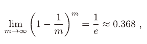

# Validation

Testing Set를 활용하여, 학습되지 않은 새로운 Sample에 대해 어떻게 작동하는지 예측하는 과정
- Testing Set에서 나온 Testing Error을 일반화 오차의 근삿값으로 생각한다.

### Hold-Out

- 데이터 셋 D를 겹치지 않는 임의의 두 집합으로 나누는 방법
- Training/Testing Set을 나눌 때, 데이터의 분포가 같게 나누어야 한다.
- 데이터 분포를 맞추기 위해서 Stratified Sampling를 사용한다.
- 일반적으로 2/3 ~ 4/5 정도를 Training Set로 사용하고, 나머지를 Testing Set로 사용한다.

### Cross Validation

- D를 k개의 Disjoint-Set으로 나누는 것으로 시작
- D = D1 ∪ D2 ∪ ... ∪ Dk, Di ∩ Dj = Ø (i != j)
- k - 1개의 부분집합들을 Training Set으로
- 나머지 하나의 부분집합을 Testing Set으로 사용
- 총 k개의 Train/Test Set이 만들어진다.
- k번의 Train/Test를 거쳐서 k개의 결과값의 평균을 구한다.
- 이는 k의 값에 따라서 결과가 달라진다.
- k-fold cross validation이라고 부른다.
    - 일반적으로 k는 10으로 둔다.
- LOOCV(Leave-One-Out Cross Validation)
    - m개의 Sample이 있는 D에 대해서 k = m으로 설정하고 cross validation을 실행하면, LOOCV(Leave-One-Out Cross Validation) 이라고 부른다.
    - 편향이 작은 장점이 존재
    - m번의 fit 과정이 필요하기 때문에 계산량이 많아진다.

### Bootstrapping

Bootstrap Sampling에 기반을 둔 기법

- m개의 Sample이 있는 D에 대해서 복원 Sampling을 통해서 D'를 복사하여 넣는다.
- 위의 과정을 m번 반복하여 같은 크기의 D'를 만들어낸다.
    - D'에 반복출현하는 Sample도 존재하며, 아예 뽑히지 않을 수도 있다.
    - m번의 과정 중 Sample이 단 한번도 뽑히지 않을 확률은 (1 - 1/m)m
    - 이에 대한 극한값은 아래와 같다
    - 
    - 대충 36.8% 정도만 D'로 들어가지 못하게 된다.
- D'를 Training Set로 사용하고, D'에 들어가지 못한 D의 Sample을 Testing Set로 활용한다.
- 비교적 데이터 셋의 크기가 적거나, Training/Testing Set로 분류가 어려울 때 사용하기 좋다.
- 하지만, 데이터 셋의 초기 데이터 분포와 달라질 수 있기 때문에, 초기 데이터 보유량이 충분할 때는 Hold-Out이나 Cross-Validation을 더 자주 활용한다.

### Parameter Tuning

- Parameter를 어떻게 설정하는가에 따라서 학습모델의 성능에 큰 차이가 발생한다.
- 때문에, 파라미터 튜닝에 대해서도 많은 고려를 해야한다.
- 다양한 Parameter들을 통해 Training 후 결과가 가장 좋은 Parameter를 취하면 된다.
    - 하지만 Parameter의 범위는 실수이기 때문에, 적당한 범위나 간격을 가지고 조절한다.
- Validation Set
    - Test Data를 활용하여 성능을 측정하기 전에 Model 평가 및 선택 과정에서 평가용으로 사용하는 데이터 셋
    - 서로 다른 모델 알고리즘을 비교할 때에는 Test Set을 사용한다.
    - 하지만 Training Set과 Validation Set을 나누어서 Model/Parameter 선택에 활용할 수 있다.